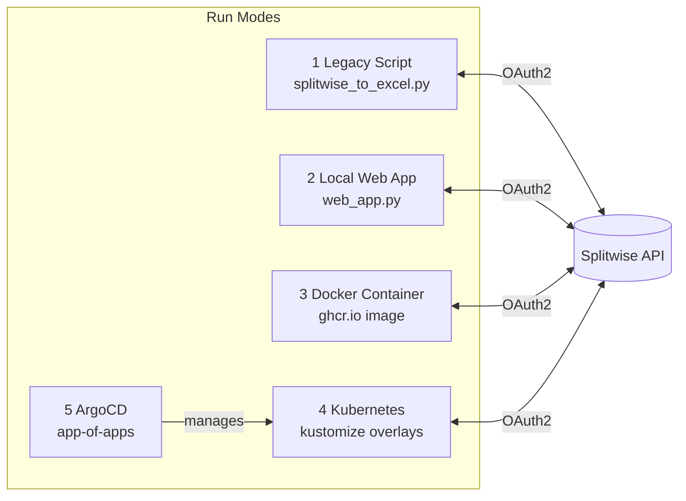
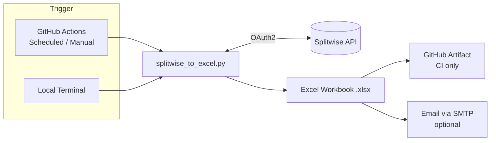
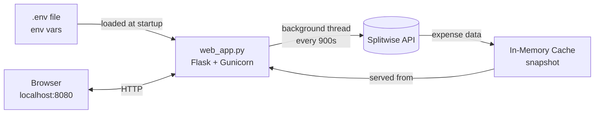
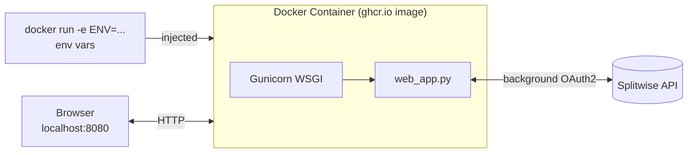
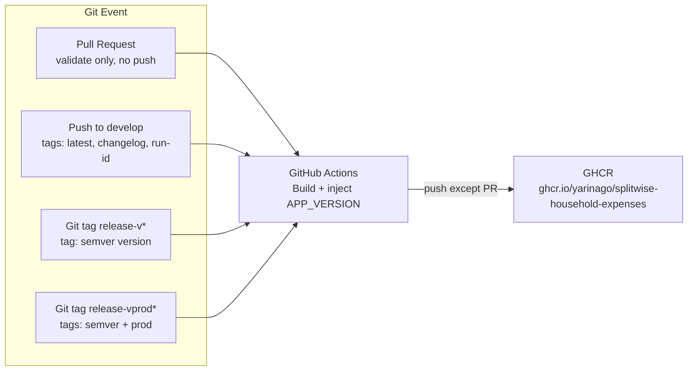
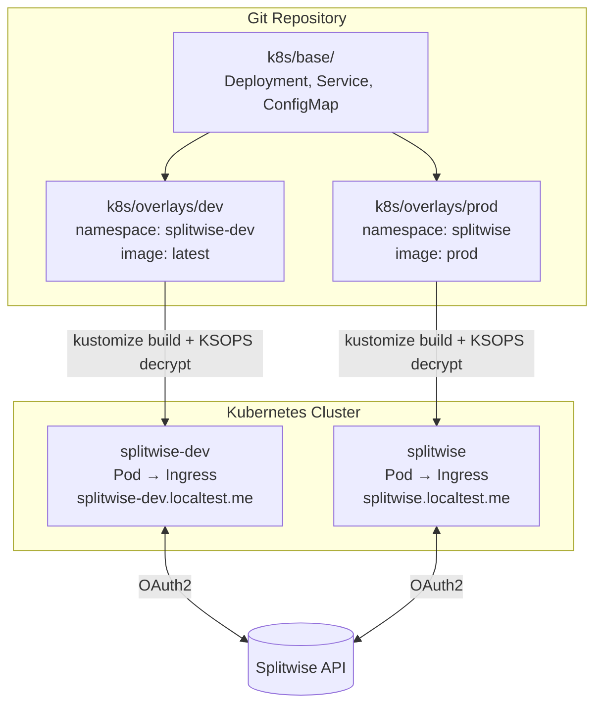
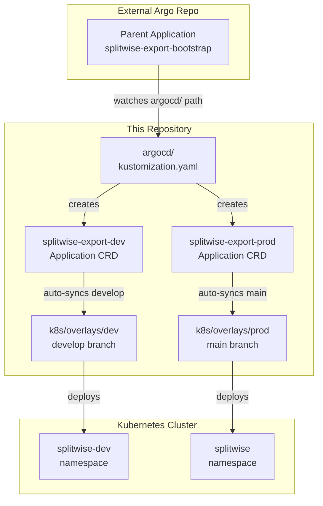

# splitwise-household-expenses

Splitwise household dashboard service.

The app now runs as a web service that computes Splitwise data in the background and serves:
- HTML dashboard: `/`
- Tables screen: `/tables`
- JSON API: `/api/dashboard`
- Health probes: `/healthz`, `/readyz`

The container image is generic. Every user must provide their own Splitwise credentials and group/member configuration at runtime.

## Table of Contents

- [Architecture Overview](#architecture-overview)
- [Legacy Excel Export](#legacy-excel-export)
- [Local Run](#local-run)
- [Run With Docker Image](#run-with-docker-image)
- [Background Compute Model](#background-compute-model)
- [Kafka Runtime Modes](#kafka-runtime-modes)
- [CI Image Build](#ci-image-build)
- [Kubernetes Layout](#kubernetes-layout)
- [Argo CD: App-Of-Apps](#argo-cd-app-of-apps)
- [ArgoCD Deployment With Your Own Secrets](#argocd-deployment-with-your-own-secrets)
- [Using Your Own Secrets and Age Keys](#using-your-own-secrets-and-age-keys)
- [Git-Encrypted Runtime Config (SOPS/Age)](#git-encrypted-runtime-config-sopsage)
  - [Migration From Existing GitHub Vars/Secrets](#migration-from-existing-github-varssecrets)

## Architecture Overview



## Legacy Excel Export



The legacy flow is still supported for backward compatibility:
- Script: `splitwise_to_excel.py`
- Workflow: `.github/workflows/splitwise-export.yml`

<details>
<summary>What <code>splitwise_to_excel.py</code> does</summary>

- Pulls Splitwise expenses for the configured group and date range.
- Builds Excel output with sheets such as `Raw_Expenses`, `Raw_Shares` (optional), `Monthly_By_Category`, `PerPerson_Month`, and `Charts`.
- Supports exclusion rules from env vars (`SPLITWISE_EXCLUDE_MONTHS`, `SPLITWISE_EXCLUDE_DESCRIPTIONS`).
- Can send the generated file by email when SMTP values are provided.

</details></br>

Run locally:
```bash
python splitwise_to_excel.py
```

<details>
<summary>Useful CLI flags</summary>

- `--out` custom output filename
- `--start` and `--end` month range (`YYYY-MM`)
- `--group-id` override group id
- `--no-raw-shares` skip `Raw_Shares` sheet
- `--debug-shares` print share parsing debug output

</details>

<details>
<summary>Legacy workflow behavior (<code>splitwise-export.yml</code>)</summary>

- Triggered on schedule at `02:00 UTC` on the 1st and 15th of each month, and by manual dispatch.
- Runs `python splitwise_to_excel.py`.
- Uses GitHub Secrets for sensitive credentials (`SPLITWISE_CLIENT_ID`, `SPLITWISE_CLIENT_SECRET`, `SPLITWISE_ACCESS_TOKEN_JSON`).
- Uses GitHub Variables for config (`SPLITWISE_GROUP_ID`, `SPLITWISE_MEMBERS`, and optional filters).
- Sends the generated workbook by email using `EMAIL_FROM` + `EMAIL_PASSWORD` to `SEND_TO_EMAIL`.
- Uploads workbook as a workflow artifact.

</details>

## Local Run



<details>
<summary><strong>How To Retrieve The Splitwise `.env` Values</strong></summary>

Before filling the `.env`, create your own Splitwise application and token:

1. Log in to Splitwise on the **web**.
2. Click your profile picture, then go to `Your account` -> `Your apps` -> `Register your applications`.
3. Enter an application name and description.
4. For local usage, set both `Homepage URL` and `Callback URL` to `http://localhost:8765/callback`.
5. After the application is created, copy the values into your `.env`:

   - `Consumer Key` -> `SPLITWISE_CLIENT_ID`
   - `Consumer Secret` -> `SPLITWISE_CLIENT_SECRET`
   - `Your API key` -> the value used in `"access_token":"your-api-key"` inside `SPLITWISE_ACCESS_TOKEN_JSON`

Use `Your API key` like this:

```bash
SPLITWISE_ACCESS_TOKEN_JSON={"access_token":"your-api-key","token_type":"bearer","refresh_token":""}
```

To retrieve the group id and member ids/names:

1. Log in to Splitwise on the **web** and open the group you want to use.
2. The number in the group URL is the group id. Put that value in `SPLITWISE_GROUP_ID`.
3. While still logged in, open `https://secure.splitwise.com/api/v3.0/get_group/{id}` in your browser and replace `{id}` with your real group id.
4. In the response, look under `members` to find each member's name and id.
5. Build `SPLITWISE_MEMBERS` as a JSON object mapping each member id to the name you want displayed, for example:

```bash
SPLITWISE_MEMBERS={"98765432":"Ally","12312312":"Bob"}
```

</details></br>

1. Install dependencies:
```bash
pip install -r requirements.txt
```

2. Provide env vars (for example via `.env` for local testing only):
```bash
SPLITWISE_CLIENT_ID=...
SPLITWISE_CLIENT_SECRET=...
SPLITWISE_ACCESS_TOKEN_JSON={"access_token":"...","token_type":"bearer","refresh_token":""}
SPLITWISE_GROUP_ID=12345678
SPLITWISE_MEMBERS={"98765432":"Ally","12312312":"Bob"}
SPLITWISE_FIRST_MONTH=2008-01
SPLITWISE_EXCLUDE_MONTHS=
SPLITWISE_EXCLUDE_DESCRIPTIONS=
SPLITWISE_REFRESH_SECONDS=900
SPLITWISE_DEBT_DIRECTION=normal
APP_VERSION=local
SPLITWISE_LOAD_DOTENV=1
PORT=8080
```


`.env` is optional and intended for local development. </br>
In Kubernetes / ArgoCD, values should come from manifests in this repo (`ConfigMap` + encrypted `Secret` files).

3. Run the web app:
```bash
python web_app.py
```

4. Open:
```text
http://localhost:8080
```

## Run With Docker Image



<details>
<summary><strong>How To Retrieve The Splitwise `.env` Values</strong></summary>

Before filling the `.env`, create your own Splitwise application and token:

1. Log in to Splitwise on the **web**.
2. Click your profile picture, then go to `Your account` -> `Your apps` -> `Register your applications`.
3. Enter an application name and description.
4. For local usage, set both `Homepage URL` and `Callback URL` to `http://localhost:8765/callback`.
5. After the application is created, copy the values into your `.env`:

   - `Consumer Key` -> `SPLITWISE_CLIENT_ID`
   - `Consumer Secret` -> `SPLITWISE_CLIENT_SECRET`
   - `Your API key` -> the value used in `"access_token":"your-api-key"` inside `SPLITWISE_ACCESS_TOKEN_JSON`

Use `Your API key` like this:

```bash
SPLITWISE_ACCESS_TOKEN_JSON={"access_token":"your-api-key","token_type":"bearer","refresh_token":""}
```

To retrieve the group id and member ids/names:

1. Log in to Splitwise on the **web** and open the group you want to use.
2. The number in the group URL is the group id. Put that value in `SPLITWISE_GROUP_ID`.
3. While still logged in, open `https://secure.splitwise.com/api/v3.0/get_group/{id}` in your browser and replace `{id}` with your real group id.
4. In the response, look under `members` to find each member's name and id.
5. Build `SPLITWISE_MEMBERS` as a JSON object mapping each member id to the name you want displayed, for example:

```bash
SPLITWISE_MEMBERS={"98765432":"Ally","12312312":"Bob"}
```

</details></br>

Anyone can run the published image with their own values.

1. Pull and run:
```bash
docker run --rm -p 8080:8080 \
  -e SPLITWISE_LOAD_DOTENV=0 \
  -e SPLITWISE_CLIENT_ID="your-client-id" \
  -e SPLITWISE_CLIENT_SECRET="your-client-secret" \
  -e SPLITWISE_ACCESS_TOKEN_JSON='{"access_token":"...","token_type":"bearer","refresh_token":""}' \
  -e SPLITWISE_GROUP_ID="12345678" \
  -e SPLITWISE_MEMBERS='{"11111111":"Alice","22222222":"Bob"}' \
  -e SPLITWISE_FIRST_MONTH="2008-01" \
  -e SPLITWISE_DEBT_DIRECTION="normal" \
  -e PORT="8080" \
  ghcr.io/yarinago/splitwise-household-expenses:latest
```

2. Open:
```text
http://localhost:8080
```

Required runtime variables:
- `SPLITWISE_CLIENT_ID`
- `SPLITWISE_CLIENT_SECRET`
- `SPLITWISE_ACCESS_TOKEN_JSON`
- `SPLITWISE_GROUP_ID`
- `SPLITWISE_MEMBERS`

Optional runtime variables:
- `SPLITWISE_FIRST_MONTH`
- `SPLITWISE_EXCLUDE_MONTHS`
- `SPLITWISE_EXCLUDE_DESCRIPTIONS`
- `SPLITWISE_REFRESH_SECONDS`
- `SPLITWISE_DEBT_DIRECTION`
- `SPLITWISE_PERSON_OWES_DIRECTION`
- `SPLITWISE_RECENT_EXPENSES_LIMIT`
- `SPLITWISE_TABLE_LIMIT`
- `APP_VERSION`

## Background Compute Model

- A background thread refreshes data every `SPLITWISE_REFRESH_SECONDS` (default `900`).
- Latest successful snapshot is cached in memory.
- Web requests read cached snapshot only; they do not call Splitwise directly.
- `POST /refresh` and `POST /api/refresh` trigger manual refresh.
- Dashboard has a 2x2 graph layout with:
  - month totals (chronological)
  - category totals (month filter)
  - per-person owes (month scope)
  - category-over-time (category selector)
- Category bars use distinct colors.
- A subtle version marker is shown in the UI header (`APP_VERSION`, fallback `EXPORT_VERSION`).
- Tables and full-data summary are split into a dedicated `/tables` page with month and text filters.

## Kafka Runtime Modes

The image now supports multiple runtime modes through `APP_MODE`:

- `web`: serves the Flask/Gunicorn dashboard
- `producer`: polls Splitwise and publishes Kafka events keyed by `expense_id`
- `consumer`: consumes Kafka events with a stable consumer group and materializes a local read model
- `loadgen`: produces synthetic `loadgen_probe` messages to create Kafka load without changing dashboard data

Kafka-specific environment variables:

- `KAFKA_BOOTSTRAP_SERVERS`
- `KAFKA_TOPIC` (default `splitwise.expenses.v1`)
- `KAFKA_GROUP_ID` (default `splitwise-dashboard-materializer`)
- `KAFKA_AUTO_OFFSET_RESET` (default `earliest`)
- optional auth/TLS vars:
  - `KAFKA_SECURITY_PROTOCOL`
  - `KAFKA_SASL_MECHANISM`
  - `KAFKA_SASL_USERNAME`
  - `KAFKA_SASL_PASSWORD`
  - `KAFKA_SSL_CA_LOCATION`

Read-model settings:

- `SPLITWISE_SNAPSHOT_BACKEND=direct|read_model`
- `SPLITWISE_READ_MODEL_DB` (default `/tmp/splitwise-read-model.db`)

Behavior:

- `producer` publishes `expense_upsert`, `expense_delete`, and `group_state` events.
- `consumer` commits offsets only after the SQLite materialization succeeds.
- `web` can keep the legacy direct-refresh path (`direct`) or read from the Kafka materialized SQLite model (`read_model`).
- `POST /refresh` in `read_model` mode writes a refresh request into the shared SQLite store for the producer to pick up.

Operational note:

- The Strimzi operator, Kafka cluster, `KafkaTopic`, `KafkaUser`, and Kafka Exporter should live in the Argo CD repo as planned.
- In this repo, the materialized read model is SQLite for simplicity. If `web` and `consumer` run as separate pods, they need a shared writable volume via `SPLITWISE_READ_MODEL_DB`, or this should be replaced later with an external database.

Prometheus metrics:

- `web` exposes `/metrics`
- `producer`, `consumer`, and `loadgen` expose Prometheus metrics on `METRICS_PORT` (default `9090`)

## CI Image Build



Workflow: `.github/workflows/splitwise-image-build.yml`

This workflow automates Docker image builds and publishing for both development and production:

- When changes are merged into the `develop` branch, the workflow builds the Docker image and pushes it to GitHub Container Registry (GHCR) with the tags: `latest`, `changelog`, and the current GitHub run ID. These tags are intended for development and testing purposes.
- When a Git tag matching `release-v*` is pushed, the workflow builds and pushes the image with the specific release tag. If the tag matches `release-vprod*`, the workflow also updates the stable `prod` tag. This is the production release track.
- On the `main` branch, the workflow can also push the `latest` tag if needed for legacy compatibility.
- On pull requests, the workflow runs the build for validation but does not push images.
- The build process injects the `APP_VERSION` build argument from image metadata.

## Kubernetes Layout



- `k8s/base`: shared manifests (`Deployment` + `Service` + `ConfigMap`)
- `k8s/overlays/dev`: development overrides + ingress + `secret.enc.yaml` + `secret-generator.yaml`
- `k8s/overlays/prod`: production overrides + ingress + `secret.enc.yaml` + `secret-generator.yaml`

Render test (requires `ksops` plugin support):
```bash
kustomize build --enable-alpha-plugins --enable-exec k8s/overlays/prod
kustomize build --enable-alpha-plugins --enable-exec k8s/overlays/dev
```

## Argo CD: App-Of-Apps



This repo contains:
- `argocd/kustomization.yaml`
- `argocd/splitwise-export-dev-application.yaml`
- `argocd/-prod-application.yaml`

These manifests define two child Argo `Application` resources:
- `splitwise-export-dev` -> `k8s/overlays/dev`
- `splitwise-export-prod` -> `k8s/overlays/prod`

In your other repo (the one that runs Argo app-of-apps), create a parent `Application` that syncs this repo's `argocd` path:

```yaml
apiVersion: argoproj.io/v1alpha1
kind: Application
metadata:
  name: splitwise-export-bootstrap
  namespace: argocd
spec:
  project: splitwise-household-expenses
  source:
    repoURL: https://github.com/yarinago/splitwise-household-expenses.git
    targetRevision: main
    path: argocd
  destination:
    server: https://kubernetes.default.svc
    namespace: argocd
  syncPolicy:
    automated:
      prune: true
      selfHeal: true
```

## ArgoCD Deployment With Your Own Secrets


## Using Your Own Secrets and Age Keys

If you (or another team) want to deploy this repository to your own Argo CD instance, you must use your own Age key pair for SOPS/KSOPS encryption and decryption. The public Age key included in this repository is only valid for the original author's Argo CD setup. If you use a different Argo CD instance, follow these steps:

1. Generate your own Age key pair (see the [Age documentation](https://github.com/FiloSottile/age)).
2. Set non-secret values in `k8s/base/configmap.yaml`.
3. Set secret values in `k8s/overlays/dev/secret.enc.yaml` and `k8s/overlays/prod/secret.enc.yaml`.
4. Encrypt secrets and configmaps with SOPS using your own Age public key:
  ```bash
  PUBLIC_AGE_KEY="<your-own-age-public-key>"
  sops --encrypt --age "${PUBLIC_AGE_KEY}" --encrypted-regex '^(data|stringData)$' --in-place k8s/base/configmap.yaml
  sops --encrypt --age "${PUBLIC_AGE_KEY}" --in-place k8s/overlays/dev/secret.enc.yaml
  sops --encrypt --age "${PUBLIC_AGE_KEY}" --in-place k8s/overlays/prod/secret.enc.yaml
  ```
5. Configure your Argo CD repo-server with the matching Age private key so it can decrypt secrets at deployment time.
6. Sync your Argo CD applications as usual.

**Important:**
- Never commit plaintext secret values.
- Never share or commit Age private keys.
- If multiple users or teams use different Age key pairs, each must encrypt with their own public key and configure their Argo CD with the matching private key.

## Git-Encrypted Runtime Config (SOPS/Age)

Runtime now supports GitOps-managed config and secret manifests:
- Non-secret env vars are in `k8s/base/configmap.yaml`
- Secret env vars are per-environment files:
  - `k8s/overlays/dev/secret.enc.yaml`
  - `k8s/overlays/prod/secret.enc.yaml`

`secret.enc.yaml` files are committed with placeholders and should be encrypted with SOPS before committing real values.
These encrypted files are materialized into Kubernetes `Secret` resources via `secret-generator.yaml` (`kind: ksops`) in each overlay.

Typical flow:
1. Fill `k8s/base/configmap.yaml` values (`SPLITWISE_GROUP_ID`, `SPLITWISE_MEMBERS`, and optional filters).
2. Fill each `secret.enc.yaml` file with real values.
3. Encrypt in-place using a public-key string variable:
```bash
PUBLIC_AGE_KEY="age1fe2ryt3m99dn4udls0f0fscrg6279jn885ls3kpxjs264vfwdgwsxmgfl9"
sops --encrypt --age "${PUBLIC_AGE_KEY}" --encrypted-regex '^(data|stringData)$' --in-place k8s/base/configmap.yaml
sops --encrypt --age "${PUBLIC_AGE_KEY}" --in-place k8s/overlays/dev/secret.enc.yaml
sops --encrypt --age "${PUBLIC_AGE_KEY}" --in-place k8s/overlays/prod/secret.enc.yaml
```
4. Commit and push. ArgoCD deploys the encrypted manifests (with decryption configured in the Argo repo).

### Migration From Existing GitHub Vars/Secrets

If values currently exist only in GitHub Variables/Secrets, do a one-time copy:
- GitHub Variables -> `k8s/base/configmap.yaml`
  - `SPLITWISE_GROUP_ID`
  - `SPLITWISE_MEMBERS`
  - `SPLITWISE_FIRST_MONTH`
  - `SPLITWISE_EXCLUDE_MONTHS`
  - `SPLITWISE_EXCLUDE_DESCRIPTIONS`
  - `SPLITWISE_REFRESH_SECONDS`
  - `SPLITWISE_DEBT_DIRECTION`
- GitHub Secrets -> each `secret.enc.yaml`
  - `SPLITWISE_CLIENT_ID`
  - `SPLITWISE_CLIENT_SECRET`
  - `SPLITWISE_ACCESS_TOKEN_JSON`

After confirming Argo deploys from encrypted files, you can remove old GitHub repo variables/secrets that were only used for runtime sync.
